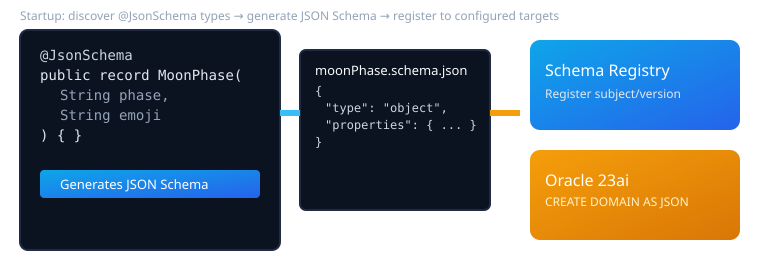

= Micronaut JSON Schema Registry
:toc: left
:icons: font

1. Project Overview

Micronaut JSON Schema Registry adds startup-time discovery of Java classes and records annotated with `io.micronaut.jsonschema.JsonSchema`, generates their JSON Schema (leveraging existing micronaut-json-schema generator/processor), and automatically registers these schemas with:
- Confluent Schema Registry (if configured)
- Oracle Database 23ai as JSON Domains (if configured)

This ensures a single source of truth for JSON validation across application layers (serialization, eventing, persistence), minimizing schema drift and enabling consistent evolution. The feature is opt‑in via configuration.

2. Concepts

- Annotation-driven discovery: Types annotated with `@JsonSchema` are considered “schema sources.”
- Deterministic schema generation: Reuses existing micronaut-json-schema capabilities to render JSON Schema Draft 2020-12.
- Registry synchronization: On application startup, schemas are reconciled against Confluent and/or Oracle 23ai so targets converge to the generated schemas.
- Idempotency: No-op updates when remote targets are already current; guarded updates when differences exist and policies allow.
- Safety modes: Configurable behavior for “first registration,” “compatible evolution,” or “strict update refusal.”

2.1 Patentable Concepts

- Cross-target schema convergence orchestration: A unified Micronaut component that deterministically generates JSON Schema then atomically propagates to heterogeneous backends (message schema registry and relational database JSON domain), with idempotent detection, compatibility checks, and rollback-aware sequencing where feasible.
- Pluggable provider SPI for multi-target schema distribution (Confluent, Oracle 23ai, custom) with policy-driven compatibility strategies and caching to guarantee consistency and performance at startup.
- Schema fingerprinting with dual-hash strategy (canonical normalized JSON + logical rule-based digest) to detect semantically equivalent changes across targets that might store metadata differently.

3. Requirements

- Micronaut 4.x; Java 17+.
- New module `json-schema-registry` providing startup synchronization.
- Optional Confluent Schema Registry endpoint and credentials.
- Optional Oracle 23ai connection using Micronaut SQL (Hikari + JDBC) with an Oracle driver on the classpath.
- Non-breaking to existing users: enabled only when configured.
- Provide metrics and health indicators for operational visibility (future).

4. Feature Descriptions

Feature 1: Startup schema discovery and generation
- Scan bean definitions for `@JsonSchema` types; load the generated schema (from processor output).
- Normalize/canonicalize schemas for comparison (sorted keys, removed ephemeral fields).

Feature 2: Confluent Schema Registry registration
- Register/update schema subjects (configurable naming strategy).
- Enforce compatibility policy (BACKWARD, FULL, NONE) based on configuration.
- Handle errors: subject not found, incompatible change, auth failures, network retries.

Feature 3: Oracle 23ai JSON Domain creation/update
- Create JSON domains (`CREATE DOMAIN <name> AS JSON VALIDATE USING <schema>`).
- Update/replace policy configurable: error on existing, drop-and-recreate (if allowed), or create-if-not-exists.
- Namespacing and naming strategy to avoid collisions; mapping from type name to domain name configurable.

Feature 4: Configuration & Conditional Activation
- The orchestration activates only if `json-schema.registry.enabled=true` and `confluent.*` and/or `oracle.*` configuration is present.
- Fine-grained toggles: enable/disable individual targets.

Feature 5: Observability and Idempotency
- Metrics (schemas processed, created, updated, skipped, errors).
- Health indicator summarizing last sync status.
- Structured logs and correlation IDs per schema subject/domain.

Feature 6: Extensibility (SPI)
- Provider SPI to add more targets (e.g., other registries or storage).
- `NamingStrategy`, `SubjectStrategy`, `CompatibilityStrategy` pluggable.

Feature 7: Safe rollout and dry-run
- Dry-run mode to compute actions without performing changes.
- “Fail-fast” vs “best-effort” modes when multiple targets are enabled.

4.1 Feature 1… (Expanded)

- Discovery: Collect all `@JsonSchema` types via Micronaut’s bean context and the json-schema-processor index.
- Generation: Use existing json-schema-generator utilities to produce Draft 2020-12 schema, stored in memory for the sync pass.
- Normalization: Canonical JSON (e.g., sorted keys), stable `$id` per configuration.

5. Project Impacts

5.1 Performance
- Startup overhead proportional to number of discovered schemas and targets.
- Confluent calls: O(N) subject checks/registrations.
- Oracle DDL: O(N) domain creation/alteration if updates are required.

5.1.1 Configuration Parameters
- `json-schema.registry.enabled`: boolean (default false).
- `json-schema.registry.targets`: list `[confluent, oracle]`.
- `json-schema.registry.dry-run`: boolean.
- `json-schema.registry.fail-fast`: boolean (default true).
- `json-schema.registry.cache.enabled`: boolean.
- `json-schema.registry.naming.subject-strategy`: string (e.g., type-simple, type-fqn).
- `json-schema.registry.naming.domain-prefix`: string.
- `json-schema.registry.compatibility.policy`: string (NONE, BACKWARD, FORWARD, FULL, etc.) for Confluent.
- `confluent.url`: string (e.g., `https://sr:8081`).
- `confluent.auth`: basic or bearer configuration.
- `confluent.subject.prefix`: string.
- `oracle.datasource`: reference to Micronaut datasource.
- `oracle.domain.prefix`, `oracle.domain.replace`: options.
- `retry.*` and `timeout.*` knobs for remote calls.

5.2 Availability
- Fail-fast mode can block startup if registration fails; best-effort mode logs warnings and continues.
- Optional async background sync after startup to improve availability.

5.2.1 Data Guard Physical Standby
- Domains are dictionary objects; creation should be executed only on primary. Guard with a role check or document DBA expectations.

5.2.2 Data Guard Logical Standby and Rolling Upgrade
- DDL must be compatible across primary/standby. Provide a toggle to skip domain creation on standbys, documented with operational playbooks.

5.3 Scalability
- Batching where possible.
- Connection pooling for HTTP and JDBC.
- Caching of “already current” targets using fingerprints (future enhancement).

5.4 System/Database Management
- Provide a command or admin endpoint to re-sync on-demand.
- Provide an option to export computed schemas to a directory for audits.

5.5 Design Constraints
- No reflection; use Micronaut bean metadata and the existing processor outputs.
- GraalVM native image compatibility.
- No breaking API changes to existing modules.

5.6 Reliability
- Retries with backoff for Confluent; transactional DDL strategy for Oracle where feasible.
- Dry-run to preview changes.

5.7 Maintainability
- SPI-based providers for targets; cohesive, testable components.
- Clear separation: discovery/generation vs. target-specific sync.

5.8 Security
- Store credentials via Micronaut configuration; support Vault or environment variables.
- TLS verification with configurable trust settings.
- Redact sensitive data in logs.

5.9 Compatibility

5.9.1 Database Compatibility
- Requires Oracle Database 23ai with JSON domain support.

5.9.2 Deprecation
- None initially; all features additive and disabled by default.

5.10 Internationalization
- Not applicable beyond messages; ensure log messages are concise and consistent.

5.11 SGA / PGA Memory Usage
- Minimal impact; a few in-memory schemas during startup. No large caches by default.

5.12 Diagnosability
- Health endpoint details last sync result.
- Metrics exported (Micrometer counters and timers).
- Structured logs with schema subject/domain and fingerprints.

5.13 Patchability
- Independent module; patched via standard library upgrades without breaking other modules.

5.14 Concurrency
- Single-threaded orchestration by default; configurable parallelism with rate limits.

5.15 Testing
- Unit tests for discovery and normalization.
- Mocked Confluent client tests.
- Oracle tests via Testcontainers (Oracle XE 23ai if available) or integration profile guarded in CI.

5.15.1 Functional Testing
- End-to-end test: define sample `@JsonSchema` types, start app with test Confluent container and Oracle Testcontainer, assert registered subjects and created domains.

6. Client Interfaces

- Configuration-driven behavior; no public runtime API required for common usage.
- SPI:
  - `RegistryTarget` (plan/apply/health).
  - `SubjectStrategy`, `NamingStrategy`, `CompatibilityStrategy`.
- Micronaut HTTP client for Confluent (implementation stub initially):
  - Endpoints used: `/subjects`, `/subjects/{subject}/versions`, `/config`, `/compatibility/subjects/{subject}/versions/{version}`.
- JDBC for Oracle:
  - DDL: `CREATE DOMAIN <name> AS JSON VALIDATE USING <schema>`; optional drop/alter depending on policy.

6.1 From Feature 1…

- Discovery service interface: `SchemaDiscoveryService`
- Normalization service: `SchemaCanonicalizer`
- Orchestrator: `SchemaRegistryOrchestrator`

7. Installation and First Use

Example minimal configuration:

[source,yaml]
----
json-schema:
  registry:
    enabled: true
    targets: [confluent, oracle]
confluent:
  url: https://localhost:8081
  auth:
    basic:
      username: user
      password: secret
datasources:
  default:
    url: jdbc:oracle:thin:@//host:1521/FREEPDB1
    driverClassName: oracle.jdbc.OracleDriver
    username: app
    password: secret
----

8. Dependencies and Effects / Software Dependencies

- Depends on Micronaut HTTP client, Micronaut SQL (Hikari), Oracle JDBC driver, Micrometer (for metrics).
- Reuses existing micronaut-json-schema modules for generation/processor.

8.1 External Impacts

- Confluent Schema Registry must be reachable; network failures delay or skip sync based on policy.
- Oracle DDL requires privileges to `CREATE DOMAIN`; coordinate with DBAs in production.

[NOTE]
====
Can the Confluent client be generated from OpenAPI specs?
If an official OpenAPI spec is available, a Micronaut declarative client can be generated. If not, a minimal typed `@Client` will be implemented for the subset of endpoints required. The latter is the initial approach for stability and scope control.
====
